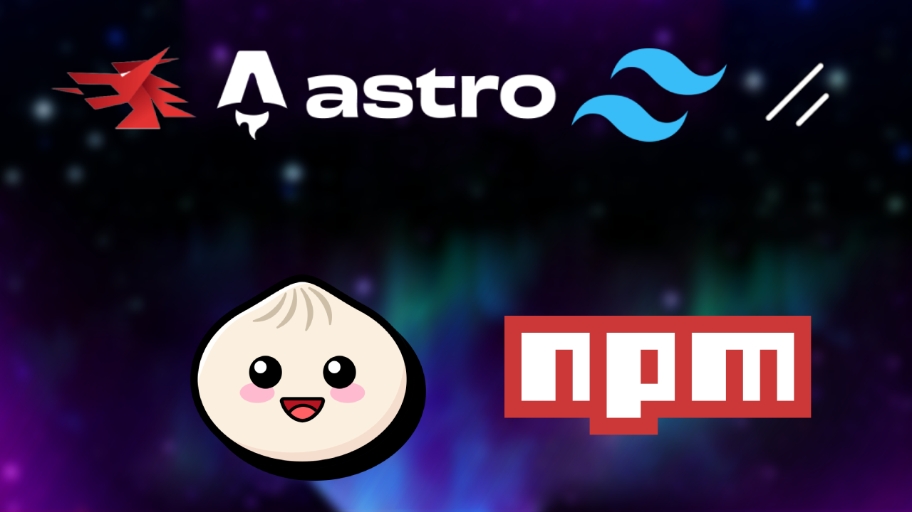

# Wails + Astro + Tailwind CSS + Shadcn/ui Template



## Overview

This template provides a starting point for Wails, preconfigured with Astro, Tailwind CSS, and Shadcn/ui. It offers support for Bun as well as **optional support** for NPM, due to compatibility issues that arise when using npm with React 19 and above.

## Versions

- **Astro**: v5.6
- **Tailwind CSS**: v4
- **Shadcn/ui CLI**: v2.4.0
- **React**: v19.1.0 and above

## Package Manager Options

By default, this template uses **Bun** for package management. If you prefer to use **npm**, you will need to make adjustments to prevent errors with certain packages.

### Switching to npm

If you choose npm, replace the following script entries in your `package.json`:

```json
"frontend:install": "bun install",
"frontend:build": "bun run build"
```

With the following npm commands:

```json
"frontend:install": "npm install --legacy-peer-deps",
"frontend:build": "npm run build"
```

## Installation Instructions

To get started, follow these steps:

1. **Initialize your Wails project** using this template:

    ```bash
    wails init -n {project-name} -t https://github.com/rutszo/wails_astro_tw_shadcn
    ```

2. **Navigate into the frontend directory**:

    ```bash
    cd {project-name}/frontend
    ```

3. **Install dependencies**:

    Depending on your package manager, run one of the following:

    - For **Bun**:

        ```bash
        bun install
        ```

    - For **npm**:

        ```bash
        npm install
        ```

## Installing Components

To install UI components from Shadcn, one of the following command:
- For **Bun**:
```bash
bunx --bun shadcn-ui@latest add [component]
```
- For **npm**:
```bash
npx shadcn-ui@latest add [component]
```

For a full list of available components, visit the [Shadcn/ui documentation](https://ui.shadcn.com/docs/components/).

## Live Development

To start live development mode:

1. In the project root directory, run:

    ```bash
    wails dev
    ```

2. In a separate terminal, navigate to the `frontend` directory and run either of the following:

    - For **Bun**:

        ```bash
        bun run dev
        ```
    - For **npm**:

        ```bash
        npm run dev
        ```

This will start the frontend development server at `http://localhost:34115`. Open this in your browser to interact with your application.

## Building for Production

To create a production-ready package, run:

```bash
wails build
```

## Credits

- **Astro**: [https://astro.build/](https://astro.build/)
- **TailwindCSS**: [https://tailwindcss.com/](https://tailwindcss.com/)
- **Shadcn/ui**: [https://ui.shadcn.com/](https://ui.shadcn.com/)
- **Wails**: [https://wails.io/](https://wails.io/)
- **Bun**: [https://bun.sh/](https://bun.sh/)
- **npm**: [https://www.npmjs.com/](https://www.npmjs.com/)
